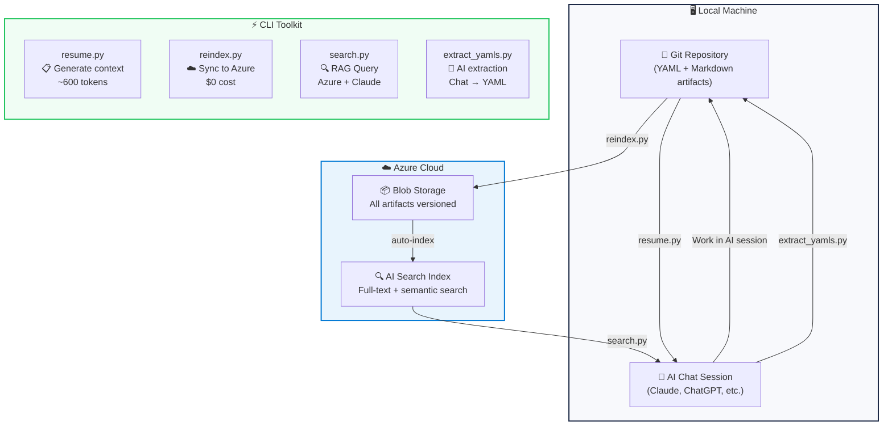
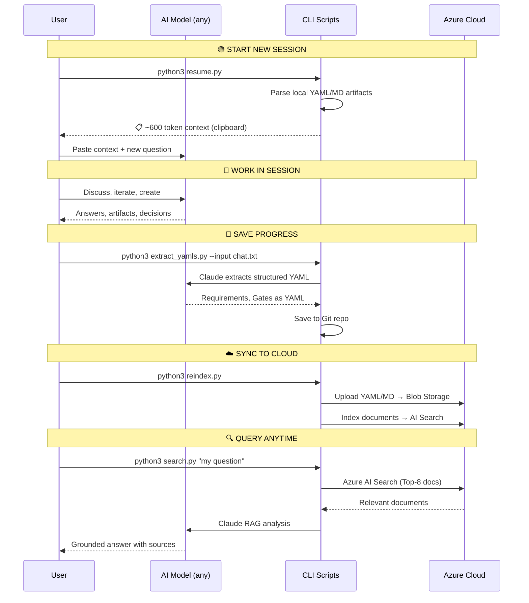

# 🏦 AI Context Vault

**Store, sync & resume AI context across models – save 98% tokens.**

> Never lose your AI work again. Keep your research artifacts in Azure Cloud, query them with RAG, and resume any AI session with a single command.

[](LICENSE)
[](https://python.org)
[](https://azure.microsoft.com)

---

## The Problem

Every AI chat session starts from scratch. Context is lost, tokens are wasted, and you repeat yourself endlessly:

```
Session 1: "Here's my project... [30,000 tokens of context]"
Session 2: "Here's my project again... [30,000 tokens of context]"
Session 3: "Here's my project AGAIN... [30,000 tokens of context]"
```

**90,000 tokens wasted** just to get back to where you were.

## The Solution

AI Context Vault stores your work artifacts in **Azure Cloud** and generates **token-optimized context** that works with **any AI model**:

```
Session 1: "Here's my project... [30,000 tokens]" → artifacts saved to Azure
Session 2: python3 resume.py → [600 tokens] ✅ Full context restored
Session 3: python3 resume.py → [600 tokens] ✅ Full context restored
```

**98% token savings.** Works with Claude, ChatGPT, Gemini, or any LLM.

---

## 🔄 Architecture & Workflow



### Workflow Step-by-Step



---

## 🚀 Quick Start

### 1. Clone & Install

```bash
git clone https://github.com/MustDemir/ai-context-vault.git
cd ai-context-vault
pip install -r requirements.txt
cp .env.example .env
# Edit .env with your credentials
```

### 2. Setup Azure Resources

```bash
# Create Azure AI Search index
python3 scripts/create_index.py
```

<details>
<summary>📋 Azure Setup Guide (click to expand)</summary>

**What you need:**
- Azure account (free tier works!)
- Storage Account (Blob Storage)
- Azure AI Search service (free tier: 50MB, 3 indexes)

**Steps:**
1. Create a Storage Account → note the name + key
2. Create an Azure AI Search service → note the endpoint + key
3. Copy `.env.example` to `.env` and fill in credentials
4. Run `python3 scripts/create_index.py` to create the search index

</details>

### 3. Daily Workflow

```bash
# 📋 Resume a previous session (copies to clipboard)
python3 scripts/resume.py

# 📋 Resume specific chapter only
python3 scripts/resume.py 04

# ☁️ Sync all artifacts to Azure
python3 scripts/reindex.py

# 🔍 Search your knowledge base
python3 scripts/search.py "what are the compliance requirements?"

# 🤖 Extract artifacts from a chat transcript
python3 scripts/extract_yamls.py --input chat.txt --type requirements
python3 scripts/extract_yamls.py --input chat.txt --type gates
```

---

## 📊 Token Savings Comparison

| Approach | Tokens per Session | 10 Sessions | Cost (Claude) |
|---|---:|---:|---:|
| ❌ Copy-paste full context | ~30,000 | 300,000 | ~$4.50 |
| ❌ Re-explain everything | ~15,000 | 150,000 | ~$2.25 |
| ✅ **AI Context Vault** | **~600** | **6,000** | **~$0.09** |

**Savings: 98% tokens, 98% cost.**

---

## 🗂️ Project Structure

```
ai-context-vault/
├── scripts/
│   ├── resume.py           # 📋 Generate token-optimized context
│   ├── reindex.py          # ☁️ Sync to Azure (Blob + Search)
│   ├── search.py           # 🔍 RAG query (Azure + Claude)
│   ├── extract_yamls.py    # 🤖 AI-powered artifact extraction
│   └── create_index.py     # 🏗️ Azure Search index setup
├── examples/
│   └── yaml_templates/     # Example YAML templates
│       ├── requirement_template.yaml
│       ├── gate_template.yaml
│       └── chapter_state_template.yaml
├── docs/
│   └── ARCHITECTURE.md     # Design decisions & architecture
├── .env.example            # Environment template (no secrets!)
├── .gitignore
├── requirements.txt
├── LICENSE
└── README.md
```

---

## 🔧 How Each Script Works

### `resume.py` – The Secret Sauce 🧪

```
Input:  Your local YAML/MD files (Git repo)
Output: ~600 token summary → clipboard

Pipeline:
1. Scan chapter_state.yaml    → chapter progress
2. Scan requirement YAMLs     → R001-R00n status
3. Scan gate YAMLs            → gate completion
4. Compile compact summary    → icons (✅/⬜/🔄)
5. Auto-copy to clipboard     → paste into any AI

Token cost: $0 (no API calls, local only)
```

### `reindex.py` – Azure Cloud Sync ☁️

```
Input:  Your local YAML/MD files
Output: Files in Azure Blob + indexed in Azure AI Search

Pipeline:
1. Find all .yaml/.yml/.md    → recursive scan
2. Upload to Blob Storage     → versioned artifacts
3. Create search documents    → metadata extraction
4. Batch upsert to Search     → retry/backoff for 429
5. SHA1-based IDs             → idempotent (safe re-run)

Token cost: $0 (Azure SDK only, no AI calls)
```

### `search.py` – RAG Query Engine 🔍

```
Input:  Natural language question
Output: AI answer grounded in YOUR documents

Pipeline:
1. Azure AI Search query      → Top-8 relevant docs
2. Assemble context           → from retrieved docs
3. Send to Claude API         → with source references
4. Return grounded answer     → [1], [2] citations

Token cost: ~$0.01-0.05 per query
```

### `extract_yamls.py` – AI Artifact Extractor 🤖

```
Input:  Chat transcript (.txt)
Output: Structured YAML files (Requirements / Gates)

Pipeline:
1. Read chat transcript       → unstructured text
2. Check existing IDs         → prevent duplicates
3. Claude API extraction      → structured JSON
4. Parse + save as YAML       → R###.yaml / G###.yaml
5. Git-ready artifacts        → commit & reindex

Token cost: ~$0.05-0.20 per extraction
```

---

## 🌐 Cross-Model Compatibility

AI Context Vault is **model-agnostic**. The `resume.py` output works with:

| Model | How to Use |
|---|---|
| **Claude** | Paste context → continue working |
| **ChatGPT** | Paste context → continue working |
| **Gemini** | Paste context → continue working |
| **Local LLMs** (Ollama, etc.) | Paste context → continue working |
| **Any future model** | Paste context → continue working |

---

## 🏗️ Azure Architecture

```
┌──────────────────────────────────────────────────┐
│                  Azure Cloud                      │
│                                                   │
│  ┌───────────────────┐  ┌──────────────────────┐ │
│  │  Blob Storage      │  │  AI Search           │ │
│  │  ─────────────     │  │  ─────────           │ │
│  │  📄 YAML files     │──│  🔍 Full-text search │ │
│  │  📄 MD docs        │  │  🔍 Semantic ranking │ │
│  │  📄 Session logs   │  │  🔍 Faceted filters  │ │
│  └───────────────────┘  └──────────────────────┘ │
│         ↑                        ↓                │
│     reindex.py               search.py            │
└──────────────────────────────────────────────────┘
         ↑                        ↓
┌──────────────────────────────────────────────────┐
│               Local Machine                       │
│                                                   │
│  📁 Git repo ──→ resume.py ──→ 📋 Clipboard      │
│       ↑                            ↓              │
│  extract_yamls.py ←── 💬 AI Chat Session          │
└──────────────────────────────────────────────────┘
```

---

## 💡 Use Cases

- **📚 Thesis / Research Management** – Track requirements, literature, progress
- **🏢 Enterprise AI Projects** – Maintain context across teams and AI models
- **⚖️ Compliance Documentation** – EU AI Act artifacts with audit trail
- **🔬 Any Long-Running AI Project** – Never lose context again

---

## 🤝 Contributing

Contributions welcome! Please open an issue or pull request.

## 📄 License

MIT License – see [LICENSE](LICENSE)

## 👤 Author

**Mustafa Demir** – SRH Fernhochschule, M.Sc. Digital Management & Transformation

[](https://github.com/MustDemir)

---

*Built with Azure AI Search, Claude API, and Python. Designed to solve the #1 pain point of working with AI: losing context between sessions.*
