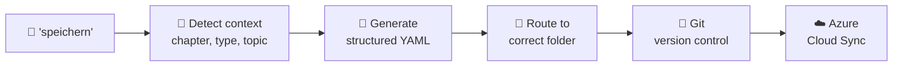
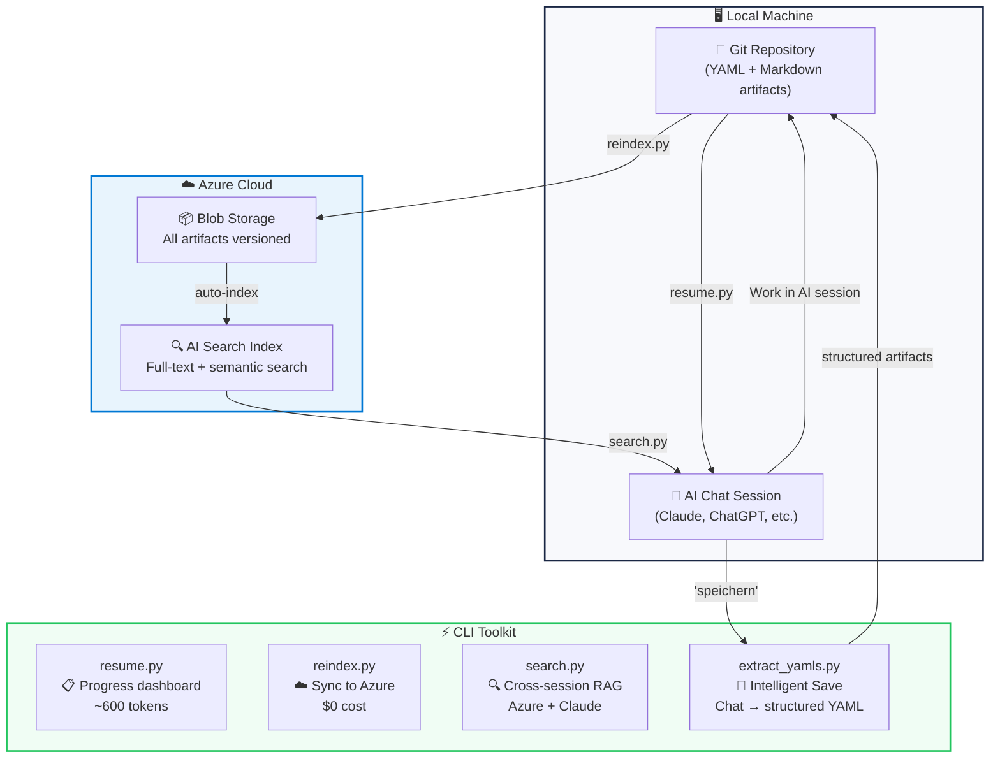
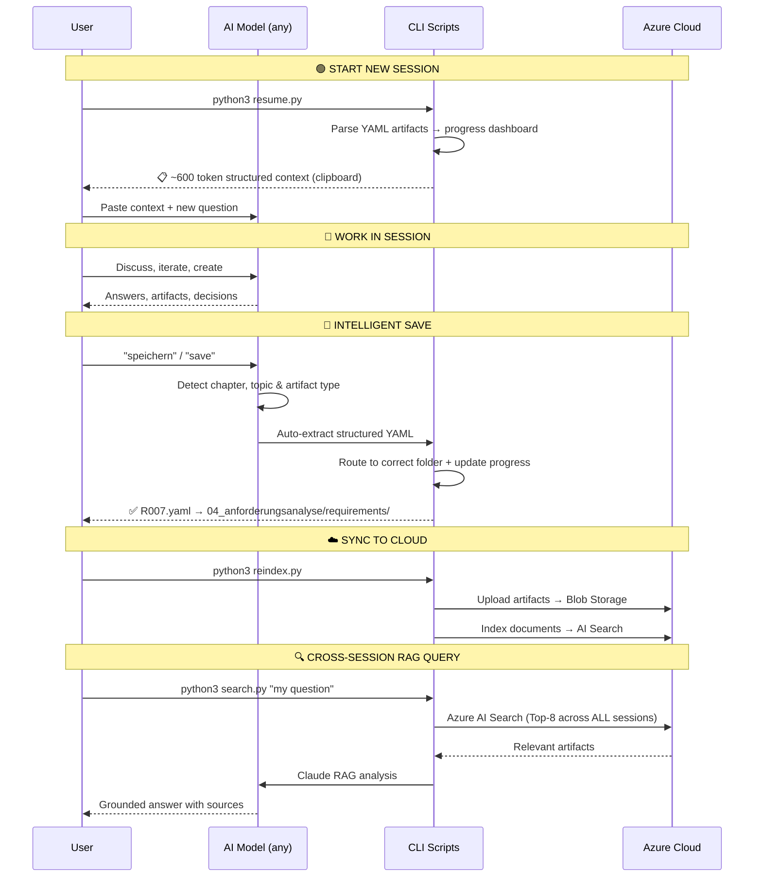

# 🏦 AI Context Vault

**Structure, manage & search your AI work artifacts – across models, with audit trail, via Azure Cloud.**

> AI models can remember. But they can't structure your work into traceable artifacts, search across all sessions, or produce compliance-ready documentation. AI Context Vault can.

[](LICENSE)
[](https://python.org)
[](https://azure.microsoft.com)

---

## The Problem

Modern AI models have memory, projects, and million-token context windows. **So what's still broken?**

### PD1: 📋 Unstructured Artifacts

Your AI work lives as **chat history** – not as manageable artifacts.

After 20 sessions you have hundreds of messages across multiple chats. Decisions, requirements, quality gates – all buried in conversation threads. No IDs, no status tracking, no categories. No way to query "all approved requirements" or "all open quality gates."

> Claude Projects and ChatGPT Memory **remember** your conversations.
> But they don't **structure** them into traceable, queryable artifacts.

### PD2: 🏝️ Isolated Knowledge Silos

Each AI model has its own walled garden:

```
Claude Projects    → only accessible in Claude
ChatGPT Memory     → only accessible in ChatGPT
Gemini Workspace   → only accessible in Gemini
```

There is no shared, neutral knowledge layer. If you use Claude for analysis, ChatGPT for writing, and Gemini for data – your knowledge is **fragmented across 3 platforms** with no connection between them.

### PD3: 📜 No Compliance-Ready Documentation

For regulated projects (EU AI Act, ISO 42001, enterprise audits), you need:
- Versioned artifacts with timestamps and sources
- Traceable decision chains
- Structured evidence documentation

**Chat history is not an audit trail.** No auditor accepts "look at my ChatGPT conversation from 3 months ago" as evidence.

---

## What AI Models Already Solve (and what they don't)

| Capability | AI Models (2026) | AI Context Vault |
|---|:---:|:---:|
| Remember context across sessions | ✅ Projects, Memory | – |
| Large context windows (200K–1M+) | ✅ Native | – |
| **Structured artifact management** | ❌ Chat history only | ✅ YAML with IDs, status, categories |
| **Cross-model knowledge base** | ❌ Isolated per platform | ✅ Azure Cloud – model-agnostic |
| **Semantic search across ALL sessions** | ❌ Within one project only | ✅ Azure AI Search – full RAG |
| **Compliance-ready audit trail** | ❌ No versioning | ✅ Git-versioned YAML |
| **Progress dashboard** | ❌ No structured overview | ✅ resume.py → ✅/⬜/🔄 |
| **Enterprise scalability** | ❌ Platform limits | ✅ Azure – unlimited |

---

## The Solution

AI Context Vault adds what AI models are missing:

| Problem | Solution |
|---|---|
| 📋 Unstructured Artifacts | Automated extraction → structured YAML with IDs, status, source references |
| 🏝️ Isolated Knowledge | Azure Blob Storage + AI Search as neutral, model-agnostic knowledge layer |
| 📜 No Audit Trail | Git-versioned YAML → traceable, timestamped, diff-able evidence chain |

**Bonus: 98% token savings** – `resume.py` compresses your full project state into ~600 tokens instead of re-loading entire project contexts.

---

## ✨ Intelligent Save

Say **"speichern"** (or **"save"**) in your AI chat.
The AI automatically extracts structured artifacts from the conversation:



This is not "save the chat." It's:
- **Chat → structured artifact** with ID, status, category, source reference
- **Auto-routing** to the correct project folder based on context
- **Progress tracking** updated automatically in `chapter_state.yaml`
- **Instantly searchable** via Azure AI Search across all sessions

> The difference: AI models remember conversations. This tool **structures them into auditable, searchable artifacts.**

---

## 🔄 Architecture & Workflow



### Workflow Step-by-Step



---

## 🚀 Quick Start

### 1. Clone & Install

```bash
git clone https://github.com/MustDemir/ai-context-vault.git
cd ai-context-vault
pip install -r requirements.txt
cp .env.example .env
# Edit .env with your credentials
```

### 2. Setup Azure Resources

```bash
# Create Azure AI Search index
python3 scripts/create_index.py
```

<details>
<summary>📋 Azure Setup Guide (click to expand)</summary>

**What you need:**
- Azure account (free tier works!)
- Storage Account (Blob Storage)
- Azure AI Search service (free tier: 50MB, 3 indexes)

**Steps:**
1. Create a Storage Account → note the name + key
2. Create an Azure AI Search service → note the endpoint + key
3. Copy `.env.example` to `.env` and fill in credentials
4. Run `python3 scripts/create_index.py` to create the search index

</details>

### 3. Daily Workflow

```bash
# ✨ INTELLIGENT SAVE (primary workflow)
# Say "speichern" or "save" in your AI chat
# → AI extracts structured YAML artifacts automatically

# 📋 Resume a session (structured progress dashboard → clipboard)
python3 scripts/resume.py

# 📋 Resume specific chapter only
python3 scripts/resume.py 04

# ☁️ Sync all artifacts to Azure
python3 scripts/reindex.py

# 🔍 Search across ALL sessions and artifacts
python3 scripts/search.py "what are the compliance requirements?"

# 🤖 Manual artifact extraction (fallback)
python3 scripts/extract_yamls.py --input chat.txt --type requirements
python3 scripts/extract_yamls.py --input chat.txt --type gates
```

---

## 📊 Token Efficiency

While modern AI models support large context windows, loading full project contexts is wasteful and expensive at scale:

| Approach | Tokens per Session | 10 Sessions | Cost (Claude) |
|---|---:|---:|---:|
| ❌ Load full project context | ~30,000 | 300,000 | ~$4.50 |
| ❌ Re-explain everything | ~15,000 | 150,000 | ~$2.25 |
| ✅ **resume.py** (structured dashboard) | **~600** | **6,000** | **~$0.09** |

Token savings become critical at **enterprise scale** (teams × sessions × days).

---

## 🗂️ Project Structure

```
ai-context-vault/
├── scripts/
│   ├── resume.py           # 📋 Structured progress dashboard
│   ├── reindex.py          # ☁️ Sync to Azure (Blob + Search)
│   ├── search.py           # 🔍 Cross-session RAG query
│   ├── extract_yamls.py    # 🧠 Intelligent Save engine
│   └── create_index.py     # 🏗️ Azure Search index setup
├── examples/
│   └── yaml_templates/     # Example YAML templates
│       ├── requirement_template.yaml
│       ├── gate_template.yaml
│       └── chapter_state_template.yaml
├── docs/
│   └── ARCHITECTURE.md     # Design decisions & architecture
├── .env.example            # Environment template (no secrets!)
├── .gitignore
├── requirements.txt
├── LICENSE
└── README.md
```

---

## 🔧 How Each Script Works

### `resume.py` – Structured Progress Dashboard 📋

```
Input:  Your local YAML/MD files (Git repo)
Output: ~600 token progress dashboard → clipboard

Pipeline:
1. Scan chapter_state.yaml    → chapter progress
2. Scan requirement YAMLs     → R001-R00n with status
3. Scan gate YAMLs            → gate completion per dimension
4. Compile structured summary → icons (✅/⬜/🔄)
5. Auto-copy to clipboard     → paste into any AI model

Token cost: $0 (no API calls, pure local parsing)
```

### `reindex.py` – Azure Cloud Sync ☁️

```
Input:  Your local YAML/MD files
Output: Files in Azure Blob + indexed in Azure AI Search

Pipeline:
1. Find all .yaml/.yml/.md    → recursive scan
2. Upload to Blob Storage     → versioned artifacts
3. Create search documents    → metadata extraction
4. Batch upsert to Search     → retry/backoff for 429
5. SHA1-based IDs             → idempotent (safe re-run)

Token cost: $0 (Azure SDK only, no AI calls)
```

### `search.py` – Cross-Session RAG Engine 🔍

```
Input:  Natural language question
Output: AI answer grounded in artifacts from ALL sessions

Pipeline:
1. Azure AI Search query      → Top-8 across entire knowledge base
2. Assemble context           → from retrieved artifacts
3. Send to Claude API         → with source references
4. Return grounded answer     → [1], [2] citations

vs. Claude Projects: searches only within ONE project
vs. AI Context Vault: searches across ALL sessions, chapters, artifact types

Token cost: ~$0.01-0.05 per query
```

### `extract_yamls.py` – Intelligent Save Engine 🧠

```
Primary:  Say "speichern" in chat → fully automatic
Fallback: python3 scripts/extract_yamls.py --input chat.txt

Pipeline:
1. Detect context             → chapter, topic, artifact type
2. Check existing IDs         → prevent duplicates
3. Claude API extraction      → conversation → structured JSON
4. Parse + save as YAML       → correct project folder with ID + status
5. Update chapter_state.yaml  → progress_pct, artifacts_count
6. Git-ready artifacts        → versionable, auditable, diff-able

Token cost: ~$0.05-0.20 per extraction
```

---

## 🌐 Cross-Model Compatibility

AI Context Vault is **model-agnostic by design**. Azure Cloud serves as the neutral knowledge layer:

| Model | How to Use |
|---|---|
| **Claude** | Paste `resume.py` output → continue working |
| **ChatGPT** | Paste `resume.py` output → continue working |
| **Gemini** | Paste `resume.py` output → continue working |
| **Local LLMs** (Ollama, etc.) | Paste `resume.py` output → continue working |
| **Any future model** | Paste `resume.py` output → continue working |

Unlike platform-specific Projects or Memory features, your artifacts live in **your** Azure subscription – independent of any AI vendor.

---

## 🏗️ Azure Architecture

```
┌──────────────────────────────────────────────────┐
│                  Azure Cloud                      │
│          (neutral, model-agnostic layer)          │
│                                                   │
│  ┌───────────────────┐  ┌──────────────────────┐ │
│  │  Blob Storage      │  │  AI Search           │ │
│  │  ─────────────     │  │  ─────────           │ │
│  │  📄 YAML artifacts │──│  🔍 Full-text search │ │
│  │  📄 MD docs        │  │  🔍 Semantic ranking │ │
│  │  📄 Evidence chain │  │  🔍 Cross-session    │ │
│  └───────────────────┘  └──────────────────────┘ │
│         ↑                        ↓                │
│     reindex.py               search.py            │
└──────────────────────────────────────────────────┘
         ↑                        ↓
┌──────────────────────────────────────────────────┐
│               Local Machine                       │
│                                                   │
│  📁 Git repo ──→ resume.py ──→ 📋 Any AI model   │
│       ↑                            ↓              │
│  "speichern" ←── 💬 AI Chat Session               │
└──────────────────────────────────────────────────┘
```

---

## 💡 Use Cases

- **🧠 Intelligent Save** – Say "save" → AI extracts structured YAML, routes to correct folder, updates progress
- **📚 Thesis / Research Management** – Track requirements, gates, progress across chapters and sessions
- **🏢 Enterprise AI Projects** – Shared knowledge base across teams and AI models via Azure
- **⚖️ Compliance Documentation** – EU AI Act / ISO 42001: Git-versioned evidence chain
- **🔍 Cross-Session Search** – RAG across ALL your AI work, not just the current project
- **🔬 Any Long-Running AI Project** – Structured artifact management at scale

---

## 🤝 Contributing

Contributions welcome! Please open an issue or pull request.

## 📄 License

MIT License – see [LICENSE](LICENSE)

## 👤 Author

**Mustafa Demir** – SRH Fernhochschule, M.Sc. Digital Management & Transformation

[](https://github.com/MustDemir)

---

*Built with Azure AI Search, Claude API, and Python. AI models remember conversations — this tool structures them into auditable, searchable, cross-model artifacts.*
