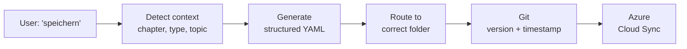
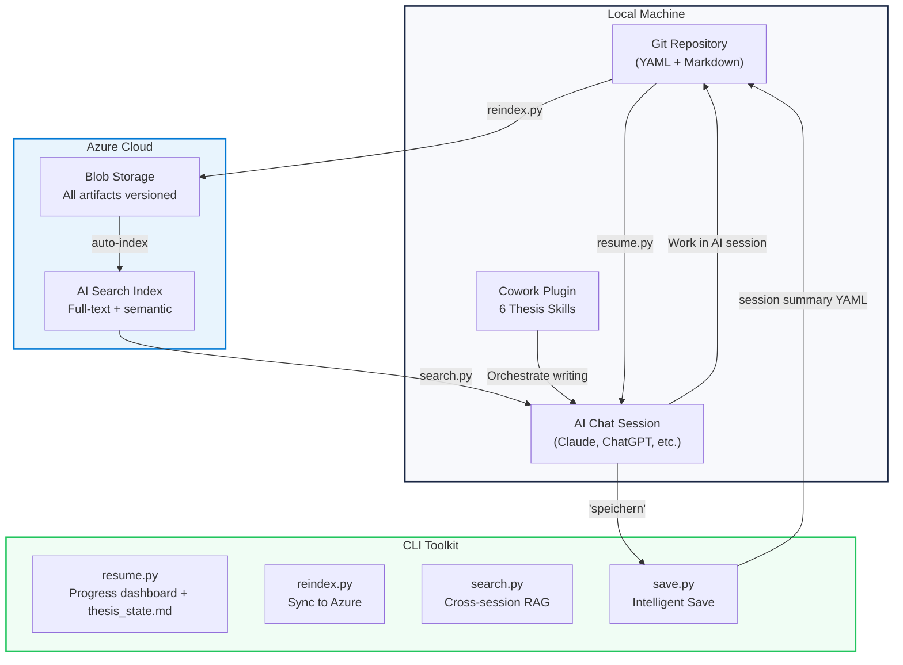
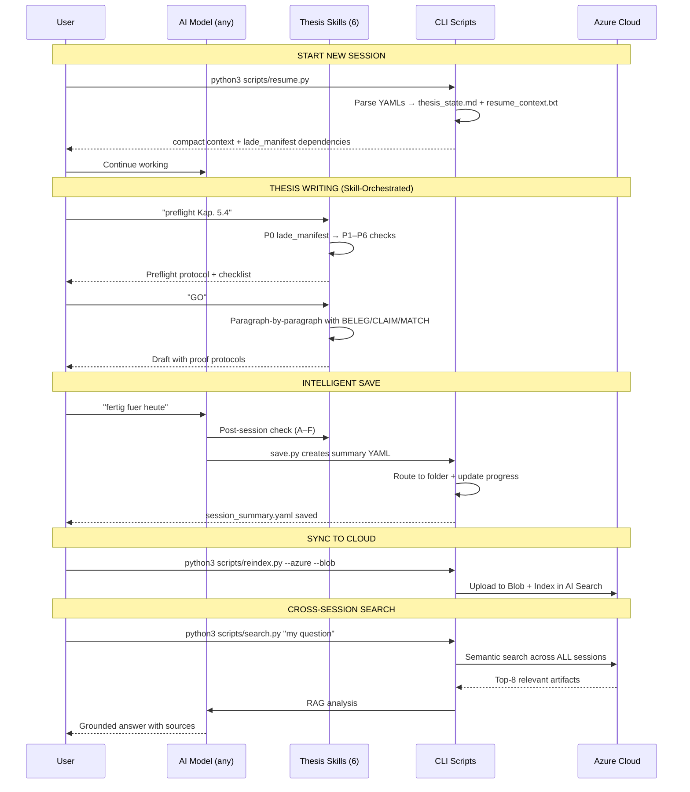

# AI Context Vault

**A reusable toolkit for turning AI sessions into structured, searchable project artifacts — plus a complete thesis-writing orchestration system built on top.**

> This repo packages a workflow I originally built in a thesis setting into a reusable toolkit. The core problem was stable across projects: **unstructured artifacts, isolated knowledge, and no audit trail**. The result is not a generic chat wrapper, but a research-informed engineering pattern for knowledge-intensive AI work.

[](LICENSE)
[](https://python.org)
[](https://azure.microsoft.com)
[](docs/ACADEMIC_VALIDATION.md)

---

## What I Built (Portfolio Snapshot)

### Core Toolkit (AI Context Management)
- Engineered an AI workflow that turns long chats into compact, structured YAML artifacts.
- Implemented one-command session persistence with auto-routing (`save.py`) and resumable context (`resume.py`).
- Added cloud synchronization and retrieval (`reindex.py`, AI Search, Blob Storage) for cross-session continuity.
- Integrated robust fallback summarization paths (Claude → Azure OpenAI → local rules).
- Built `docs/thesis_state.md` as a generated SSOT (Single Source of Truth) snapshot from chapter states.

### Thesis-Writing Orchestration (6-Skill Plugin System)
- Designed and implemented a **6-skill Cowork plugin** (`thesis-workflow`) that orchestrates the entire academic writing process — from pre-flight checks through writing to post-session verification.
- Built a **per-chapter dependency management system** (`lade_manifest`) with 2-tier context loading: `pflicht` (fulltext) and `kontext` (metadata only) — reducing AI context window consumption while maintaining cross-chapter consistency.
- Implemented **automated quality assurance** with 7 consistency dimensions, academic reviewer simulation (SRH 50/30/20 scoring), and BELEG/CLAIM/MATCH proof protocols for every paragraph.
- Integrated **university requirements as code**: Prof. Prinz style rules and SRH grading criteria codified as enforceable checks across all workflow skills.
- Created **CI/CD for academic writing**: GitHub Actions for structure validation, weekly audits, branch drift detection, and automated progress tracking.

### Cloud & DevOps
- Productionized multi-repo isolation with dedicated Blob containers to prevent cross-project context mixing.
- Implemented SHA-256 change detection for incremental Blob sync (skip unchanged files).
- Built semantic search (Azure AI Search + Claude RAG) across all sessions with repo-scoped filtering.
- Automated README progress bars via `update_progress.py` triggered by session saves.

---

## The Problem

Working on complex AI projects across multiple models and sessions, I discovered **3 concrete problems** that modern AI platforms don't solve:

### PD1: Unstructured Artifacts

AI models (Claude Projects, ChatGPT Memory, Gemini Workspace) remember conversations well. But they store **files, not manageable artifacts**.

After 20 sessions, I had:
- Hundreds of messages scattered across chats
- Decisions, requirements, quality gates buried in threads
- No way to query "all approved requirements" or "all open gates"
- No structured overview

> **Literature says:** Cloud-based artifact management with structure (not just files) improves collaboration in distributed teams (Schlegel & Sattler, 2022; Gaikwad, 2024).

### PD2: Isolated Knowledge Silos

```
Claude Projects    → only accessible in Claude
ChatGPT Memory     → only accessible in ChatGPT
Gemini Workspace   → only accessible in Gemini
```

My knowledge was **fragmented** – no shared layer across models.

> **Literature says:** Cloud-based knowledge services improve accessibility and coordination in distributed teams (Gupta et al., 2022; Muralikumar & McDonald, 2025).

### PD3: No Compliance-Ready Documentation

For regulated or research-heavy AI work, I needed:
- Versioned artifacts with timestamps and sources
- Traceable decision chains
- Structured evidence

Chat history is **not an audit trail**.

> **Literature says:** Structured, versioned artifact management and documentation are core best practices for AI governance and regulatory compliance (Winecoff & Bogen, 2024; Lucaj et al., 2025; Cantallops et al., 2021).

---

## My Solution

I combined **3 established best practices** from research into one toolkit:

| Problem | Research-Based Solution |
|---|---|
| Unstructured Artifacts | Cloud artifact management + structured YAML with metadata |
| Isolated Knowledge | Azure Cloud as neutral, model-agnostic knowledge layer |
| No Audit Trail | Git-versioned YAML → traceable, diff-able, timestamped |

**Bonus:** Context compression reduces full project state (30,000 tokens) to ~600 tokens — aligns with RAG best practices (Liu et al., 2023; Akesson & Santos, 2024).

---

## Thesis-Writing Plugin: 6-Skill Orchestration

Built on top of the core toolkit, I developed a **Cowork plugin** that orchestrates the entire thesis-writing process for my Master's thesis (GenAIOps Reference Architecture with Quality Gates, Design Science Research).

### The 6 Skills

| # | Skill | Trigger | What It Does |
|---|-------|---------|-------------|
| 1 | **thesis-session-manager** | "neue session", "resume" | Orchestrates start → preflight → writing → post-session |
| 2 | **thesis-preflight** | "preflight", "GO vorbereiten" | P0 (lade_manifest) + P1–P6: Expose, chapter texts, sessions, decisions, sources, university requirements |
| 3 | **thesis-writer** | "GO", "FINAL" | Paragraph-by-paragraph writing with BELEG/CLAIM/MATCH proof protocols, APA7 enforcement |
| 4 | **thesis-reviewer** | "review kapitel", "gutachten" | Academic reviewer simulation: R1–R6 scoring (SRH 50/30/20 criteria) |
| 5 | **thesis-consistency** | "konsistenz pruefen" | 7 consistency dimensions: terminology, red thread, budget, forward refs, drift, cross-chapter, university |
| 6 | **thesis-post-session** | "fertig fuer heute" | 6-point verification (A–F): artifacts, chapter_state, summary, decisions, diff, expose delta |

### Workflow

```
Session Start → session-manager (S1–S5) → preflight (P0–P6) → "GO" → writer → post-session (A–F) → save.py
                                                                                    ↓
                                                              consistency (K1–K7) ← bei Bedarf
                                                              reviewer (R1–R6)   ← bei Bedarf
```

### lade_manifest: Per-Chapter Dependency Management

Each chapter declares its dependencies in `chapter_state.yaml`:

```yaml
lade_manifest:
  pflicht:           # Load as FULLTEXT (high priority)
    - "docs/uni_vorgaben/pruefkatalog.md"
    - "00_workspace/Fulltext_Kapitel/Kapitel 3 Forschungsdesign.docx"
  kontext:           # Load chapter_state only (metadata)
    - "04_anforderungsanalyse_RQ1"
    - "05_referenzarchitektur_RQ2"
```

**Universal pflicht files** (loaded for every chapter): DSR methodology (Kap. 3 DOCX) + university requirements (`pruefkatalog.md`).

This system supplements (never replaces) existing checks — all 6 skills read the manifest before execution.

---

## Intelligent Save

The practical result: I can say **"speichern"** (or **"save"**) in my AI chat, and Claude automatically:


```mermaid
flowchart LR
    U["User: 'speichern'"]
    A["Detect context\nchapter, type, topic"]
    Y["Generate\nstructured YAML"]
    G["Route to\ncorrect folder"]
    V["Git\nversion + timestamp"]
    C["Azure\nCloud Sync"]

    U --> A --> Y --> G --> V --> C
```

This is **not just "save the chat."** It's:
- **Chat → structured artifact** with ID, status, source reference
- **Auto-routing** to the correct project folder
- **Progress tracking** updated automatically
- **Instantly searchable** via Azure AI Search

---

## Architecture & Workflow


```mermaid
flowchart TB
    subgraph LOCAL["Local Machine"]
        direction TB
        GIT["Git Repository\n(YAML + Markdown)"]
        CHAT["AI Chat Session\n(Claude, ChatGPT, etc.)"]
        SKILLS["Cowork Plugin\n6 Thesis Skills"]
    end

    subgraph AZURE["Azure Cloud"]
        direction TB
        BLOB["Blob Storage\nAll artifacts versioned"]
        SEARCH["AI Search Index\nFull-text + semantic"]
    end

    subgraph SCRIPTS["CLI Toolkit"]
        direction TB
        S1["resume.py\nProgress dashboard + thesis_state.md"]
        S2["reindex.py\nSync to Azure"]
        S3["search.py\nCross-session RAG"]
        S4["save.py\nIntelligent Save"]
    end

    CHAT -->|"Work in AI session"| GIT
    SKILLS -->|"Orchestrate writing"| CHAT
    GIT -->|"reindex.py"| BLOB
    BLOB -->|"auto-index"| SEARCH
    SEARCH -->|"search.py"| CHAT
    GIT -->|"resume.py"| CHAT
    CHAT -->|"'speichern'"| S4
    S4 -->|"session summary YAML"| GIT

    style LOCAL fill:#f8f9fc,stroke:#1a2744,stroke-width:2px
    style AZURE fill:#e8f4fd,stroke:#0078D4,stroke-width:2px
    style SCRIPTS fill:#f0fdf4,stroke:#22c55e,stroke-width:2px
```

### Workflow Step-by-Step


```mermaid
sequenceDiagram
    participant User
    participant AI as AI Model (any)
    participant Skills as Thesis Skills (6)
    participant Scripts as CLI Scripts
    participant Azure as Azure Cloud

    Note over User,Azure: START NEW SESSION
    User->>Scripts: python3 scripts/resume.py
    Scripts->>Scripts: Parse YAMLs → thesis_state.md + resume_context.txt
    Scripts-->>User: compact context + lade_manifest dependencies
    User->>AI: Continue working

    Note over User,Azure: THESIS WRITING (Skill-Orchestrated)
    User->>Skills: "preflight Kap. 5.4"
    Skills->>Skills: P0 lade_manifest → P1–P6 checks
    Skills-->>User: Preflight protocol + checklist
    User->>Skills: "GO"
    Skills->>Skills: Paragraph-by-paragraph with BELEG/CLAIM/MATCH
    Skills-->>User: Draft with proof protocols

    Note over User,Azure: INTELLIGENT SAVE
    User->>AI: "fertig fuer heute"
    AI->>Skills: Post-session check (A–F)
    AI->>Scripts: save.py creates summary YAML
    Scripts->>Scripts: Route to folder + update progress
    Scripts-->>User: session_summary.yaml saved

    Note over User,Azure: SYNC TO CLOUD
    User->>Scripts: python3 scripts/reindex.py --azure --blob
    Scripts->>Azure: Upload to Blob + Index in AI Search

    Note over User,Azure: CROSS-SESSION SEARCH
    User->>Scripts: python3 scripts/search.py "my question"
    Scripts->>Azure: Semantic search across ALL sessions
    Azure-->>Scripts: Top-8 relevant artifacts
    Scripts->>AI: RAG analysis
    AI-->>User: Grounded answer with sources
```

---

## Quick Start

### 1. Clone & Install

```bash
git clone https://github.com/MustDemir/ai-context-vault.git
cd ai-context-vault
pip install -r requirements.txt
cp .env.example .env
# Edit .env with your Azure credentials
```

### 2. Setup Azure Resources

```bash
python3 scripts/create_index.py
```

<details>
<summary>Azure Setup Guide (click to expand)</summary>

**What you need:**
- Azure account (free tier works!)
- Storage Account (Blob Storage)
- Azure AI Search service (free tier: 50MB, 3 indexes)

**Steps:**
1. Create a Storage Account → note the name + key
2. Create an Azure AI Search service → note the endpoint + key
3. Copy `.env.example` to `.env` and fill in credentials
4. Run `python3 scripts/create_index.py` to create the search index

</details>

### 3. Daily Workflow

```bash
# INTELLIGENT SAVE (primary)
python3 scripts/save.py --input session_notes.txt --source chatgpt --topic auto

# Optional Blob sync
python3 scripts/save.py --input session_notes.txt --topic auto --blob

# Resume a session (generates thesis_state.md + resume_context.txt)
python3 scripts/resume.py

# Sync all artifacts to Azure
python3 scripts/reindex.py --azure --blob

# Search across all sessions
python3 scripts/search.py "what are the compliance requirements?"
```

### 4. Install Thesis Plugin (for Cowork/Claude Desktop)

```bash
# The plugin file is in plugins/
# Install via Cowork: drag plugins/thesis-workflow_v3.plugin into Cowork
```

---

## Token Efficiency

While modern AI models support large context windows, reloading full project contexts per session is inefficient:

| Approach | Tokens per Session | 10 Sessions | Cost (Claude) |
|---|---:|---:|---:|
| Load full project context | ~30,000 | 300,000 | ~$4.50 |
| Re-explain everything | ~15,000 | 150,000 | ~$2.25 |
| **resume.py** (structured) | **~600** | **6,000** | **~$0.09** |
| **+ lade_manifest** (focused) | **~400** | **4,000** | **~$0.06** |

Savings matter at scale — and align with RAG optimization research (Liu et al., 2023; Jin et al., 2024).

---

## Project Structure

```
ai-context-vault/
├── scripts/
│   ├── save.py             # Primary end-of-session summary save (3-tier LLM fallback)
│   ├── workflow_lib.py     # Shared save/reindex/resume logic + lade_manifest support
│   ├── resume.py           # Compact resume context + generated docs/thesis_state.md
│   ├── reindex.py          # Sync summaries to Azure (Blob + Search) with SHA-256 dedup
│   ├── search.py           # Cross-session RAG query (Azure AI Search + Claude)
│   ├── extract_yamls.py    # Legacy/manual YAML extraction from chat exports
│   ├── create_index.py     # Azure Search index setup
│   ├── validate_structure.py  # CI structure validation
│   ├── update_progress.py  # README progress bar generation
│   ├── weekly_audit.py     # Weekly GitHub Issue audit (structure, stale files)
│   ├── weekly_branch_drift.py  # Branch drift snapshot
│   ├── workflow_smoke.py   # Local workflow smoke tests
│   └── generate_diagrams.py   # Thesis diagram generation (Pillow)
├── skills/                    # Thesis-Writing Skills (Cowork Plugin Source)
│   ├── SKILL_OVERVIEW.md      # Architecture + changelog (v2.1)
│   ├── thesis-preflight/      # P0 (lade_manifest) + P1–P6
│   ├── thesis-writer/         # BELEG/CLAIM/MATCH + APA7
│   ├── thesis-reviewer/       # R1–R6 academic reviewer
│   ├── thesis-consistency/    # K1–K7 cross-chapter
│   ├── thesis-post-session/   # A–F verification
│   └── thesis-session-manager/  # S1–S5 / E1–E4 orchestration
├── plugins/
│   └── thesis-workflow_v3.plugin  # Installable Cowork plugin (ZIP)
├── legacy/                    # Archived plugin/scripts snapshots from older workflow versions
├── docs/
│   ├── ARCHITECTURE.md        # Design decisions
│   ├── ACADEMIC_VALIDATION.md # Research backing
│   └── session_summaries/     # Toolkit session summaries
├── examples/
│   ├── session_summaries/     # Example summary artifacts
│   └── yaml_templates/        # YAML templates (requirements, gates, chapter_state)
├── .memory/                   # Generated local index + resume context (gitignored)
├── .github/workflows/         # CI: validate-structure, weekly-audit, update-progress
├── .env.example
├── requirements.txt
├── LICENSE
└── README.md
```

---

## How Each Script Works

### `save.py` – Intelligent Save

```
Input:  Short session notes (--input/--text/stdin)
Output: Compact YAML summary routed to the right folder

Pipeline:
1. Detect topic             → architecture/requirements/evaluation/general
2. Build summary bullets    → decisions + next steps
3. LLM summary (3-tier):   Claude → Azure OpenAI → local rules
4. Save YAML artifact       → session_summaries/*
5. Update chapter_state     → progress, done, next_steps
6. Optional Blob sync       → explicit --blob or SAVE_AUTO_BLOB_SYNC=1
```

### `resume.py` – Context Loader + SSOT Generator

```
Input:  All chapter_state.yaml + session summaries
Output: .memory/resume_context.txt (cache) + docs/thesis_state.md (generated SSOT snapshot)

thesis_state.md contains:
- Kapitelstatus with progress
- lade_manifest dependency matrix (all chapters)
- Decisions aggregated (ID + chapter + rationale)
- Critical Definitions (cross-chapter binding)
- Requirements (RQ1) + Quality Gates (RQ2)
- Latest session summaries per topic
```

### `reindex.py` – Azure Cloud Sync

```
Input:  Local session summaries + input files
Output: Updated Blob + AI Search index

Features:
- SHA-256 change detection (skip unchanged)
- Input file sync (--input-blob)
- Schema-aware Azure Search push
```

### `search.py` – Cross-Session RAG

```
Input:  Natural language question
Output: Grounded answer from indexed summaries

Pipeline:
1. Azure AI Search (Top-8, repo-scoped)
2. Assemble context from retrieved artifacts
3. Send to Claude API with references
4. Return answer with [1], [2] citations
```

---

## Cross-Model Compatibility

This toolkit is **model-agnostic by design**. Azure Cloud is the neutral knowledge layer:

| Model | How to Use |
|---|---|
| **Claude** | Paste `resume.py` output → continue |
| **ChatGPT** | Paste `resume.py` output → continue |
| **Gemini** | Paste `resume.py` output → continue |
| **Local LLMs** | Paste `resume.py` output → continue |
| **Any future model** | Paste `resume.py` output → continue |

Unlike Claude Projects (Claude-only) or ChatGPT Memory (ChatGPT-only), your artifacts live in **your** Azure subscription — independent of any vendor.

---

## Academic Backing

This toolkit combines **3 established best practices from peer-reviewed research**:

1. **Cloud Artifact Management** → Improves collaboration in distributed teams
2. **Structured Documentation** → Core best practice for AI governance and compliance
3. **Context Reuse + RAG** → Established optimization direction

**See [docs/ACADEMIC_VALIDATION.md](docs/ACADEMIC_VALIDATION.md) for complete research backing and citations.**

The specific combination (Azure + RAG + CLI + YAML) is an **engineering pattern** based on established principles — not yet a formalized standard, but aligned with research recommendations for production-ready RAG systems.

---

## Azure Architecture

```
┌──────────────────────────────────────────────────┐
│                  Azure Cloud                      │
│        (neutral, model-agnostic layer)            │
│                                                   │
│  ┌───────────────────┐  ┌──────────────────────┐ │
│  │  Blob Storage      │  │  AI Search           │ │
│  │  ─────────────     │  │  ─────────           │ │
│  │  YAML artifacts    │──│  Full-text search    │ │
│  │  MD docs           │  │  Semantic ranking    │ │
│  │  Evidence chain    │  │  Cross-session       │ │
│  └───────────────────┘  └──────────────────────┘ │
│         ↑                        ↓                │
│     reindex.py               search.py            │
└──────────────────────────────────────────────────┘
         ↑                        ↓
┌──────────────────────────────────────────────────┐
│               Local Machine                       │
│                                                   │
│  Git repo ──→ resume.py ──→ Any AI model          │
│       ↑                            ↓              │
│  "speichern" ←── AI Chat + 6 Thesis Skills        │
└──────────────────────────────────────────────────┘
```

---

## Use Cases

- **Thesis Management** – Track requirements, gates, progress across chapters with 6 orchestrated skills
- **Intelligent Save** – `save.py` creates compact summary YAML, routes it, and syncs
- **Multi-Model Projects** – Shared knowledge base across Claude, ChatGPT, Gemini via Azure
- **Compliance Documentation** – Git-versioned evidence chain (EU AI Act, ISO 42001)
- **Cross-Session Search** – RAG across ALL your work, not just current project
- **Knowledge-Intensive Projects** – Structured artifact management at scale

---

## Contributing

Contributions welcome! Please open an issue or pull request.

## License

MIT License – see [LICENSE](LICENSE)

## Author

**Mustafa Demir** – SRH Fernhochschule, M.Sc. Digital Management & Transformation

[](https://github.com/MustDemir)

---

*Built with Azure, Claude API, Python, and Cowork. I recognized a problem in my AI workflow, researched how established best practices could solve it, and implemented a toolkit with a thesis-writing orchestration layer on top. It's research-backed engineering, not reinventing the wheel.*
