# 🏦 AI Context Vault

**I improved my AI workflow by combining research-backed best practices into a personal toolkit.**

> Working on a thesis with multiple AI models (Claude, ChatGPT, Gemini), I faced a consistent problem: **unstructured artifacts, isolated knowledge, and no audit trail**. I researched how established practices could solve this, implemented them, and built this toolkit. It's not an enterprise product — it's a research-backed engineering pattern designed for knowledge-intensive AI projects.

[](LICENSE)
[](https://python.org)
[](https://azure.microsoft.com)
[](docs/ACADEMIC_VALIDATION.md)

---

## The Problem I Faced

Working on complex AI projects across multiple models and sessions, I discovered **3 concrete problems** that modern AI platforms don't solve:

### PD1: 📋 Unstructured Artifacts

AI models (Claude Projects, ChatGPT Memory, Gemini Workspace) remember conversations well. But they store **files, not manageable artifacts**.

After 20 sessions, I had:
- Hundreds of messages scattered across chats
- Decisions, requirements, quality gates buried in threads
- No way to query "all approved requirements" or "all open gates"
- No structured overview

> **Literature says:** Cloud-based artifact management with structure (not just files) improves collaboration in distributed teams (Schlegel & Sattler, 2022; Gaikwad, 2024).

### PD2: 🏝️ Isolated Knowledge Silos

```
Claude Projects    → only accessible in Claude
ChatGPT Memory     → only accessible in ChatGPT
Gemini Workspace   → only accessible in Gemini
```

My knowledge was **fragmented** – no shared layer across models.

> **Literature says:** Cloud-based knowledge services improve accessibility and coordination in distributed teams (Gupta et al., 2022; Muralikumar & McDonald, 2025).

### PD3: 📜 No Compliance-Ready Documentation

For my thesis (especially with EU AI Act context), I needed:
- Versioned artifacts with timestamps and sources
- Traceable decision chains
- Structured evidence

Chat history is **not an audit trail**.

> **Literature says:** Structured, versioned artifact management and documentation are core best practices for AI governance and regulatory compliance (Winecoff & Bogen, 2024; Lucaj et al., 2025; Cantallops et al., 2021).

---

## My Solution

I combined **3 established best practices** from research into one toolkit:

| Problem | Research-Based Solution |
|---|---|
| 📋 Unstructured Artifacts | Cloud artifact management + structured YAML with metadata |
| 🏝️ Isolated Knowledge | Azure Cloud as neutral, model-agnostic knowledge layer |
| 📜 No Audit Trail | Git-versioned YAML → traceable, diff-able, timestamped |

**Bonus:** Context compression reduces full project state (30,000 tokens) to ~600 tokens — aligns with RAG best practices (Liu et al., 2023; Akesson & Santos, 2024).

---

## ✨ Intelligent Save

The practical result: I can say **"speichern"** (or **"save"**) in my AI chat, and Claude automatically:

```mermaid
flowchart LR
    U["👤 'speichern'"]
    A["🤖 Detect context\nchapter, type, topic"]
    Y["📄 Generate\nstructured YAML"]
    G["📁 Route to\ncorrect folder"]
    V["🔖 Git\nversion + timestamp"]
    C["☁️ Azure\nCloud Sync"]

    U --> A --> Y --> G --> V --> C
```



This is **not just "save the chat."** It's:
- **Chat → structured artifact** with ID, status, source reference
- **Auto-routing** to the correct project folder
- **Progress tracking** updated automatically
- **Instantly searchable** via Azure AI Search

---

## 🔄 Architecture & Workflow

```mermaid
flowchart TB
    subgraph LOCAL["🖥️ Local Machine"]
        direction TB
        GIT["📁 Git Repository\n(YAML + Markdown)"]
        CHAT["💬 AI Chat Session\n(Claude, ChatGPT, etc.)"]
    end

    subgraph AZURE["☁️ Azure Cloud"]
        direction TB
        BLOB["📦 Blob Storage\nAll artifacts versioned"]
        SEARCH["🔍 AI Search Index\nFull-text + semantic"]
    end

    subgraph SCRIPTS["⚡ CLI Toolkit"]
        direction TB
        S1["resume.py\n📋 Progress dashboard"]
        S2["reindex.py\n☁️ Sync to Azure"]
        S3["search.py\n🔍 Cross-session RAG"]
        S4["save.py\n🧠 Intelligent Save"]
    end

    CHAT -->|"Work in AI session"| GIT
    GIT -->|"reindex.py"| BLOB
    BLOB -->|"auto-index"| SEARCH
    SEARCH -->|"search.py"| CHAT
    GIT -->|"resume.py"| CHAT
    CHAT -->|"'speichern'"| S4
    S4 -->|"session summary YAML"| GIT

    style LOCAL fill:#f8f9fc,stroke:#1a2744,stroke-width:2px
    style AZURE fill:#e8f4fd,stroke:#0078D4,stroke-width:2px
    style SCRIPTS fill:#f0fdf4,stroke:#22c55e,stroke-width:2px
```



### Workflow Step-by-Step

```mermaid
sequenceDiagram
    participant User
    participant AI as AI Model (any)
    participant Scripts as CLI Scripts
    participant Azure as Azure Cloud

    Note over User,Azure: 🟢 START NEW SESSION
    User->>Scripts: python3 resume.py
    Scripts->>Scripts: Parse YAML artifacts → progress dashboard
    Scripts-->>User: 📋 ~600 token context (clipboard)
    User->>AI: Paste + continue working

    Note over User,Azure: 💬 WORK IN SESSION
    User->>AI: Discuss, iterate, create decisions
    AI-->>User: Answers, artifacts, requirements

    Note over User,Azure: 💾 INTELLIGENT SAVE
    User->>AI: "speichern" / "save"
    AI->>AI: Session decisions + next steps
    AI->>Scripts: save.py creates compact summary YAML
    Scripts->>Scripts: Route to folder + update progress
    Scripts-->>User: ✅ 2026..._session-summary.yaml saved

    Note over User,Azure: ☁️ SYNC TO CLOUD
    User->>Scripts: python3 reindex.py
    Scripts->>Azure: Upload to Blob Storage
    Scripts->>Azure: Index in AI Search

    Note over User,Azure: 🔍 CROSS-SESSION SEARCH
    User->>Scripts: python3 search.py "my question"
    Scripts->>Azure: Semantic search across ALL sessions
    Azure-->>Scripts: Top-8 relevant artifacts
    Scripts->>AI: RAG analysis
    AI-->>User: Grounded answer with sources
```



---

## 🚀 Quick Start

### 1. Clone & Install

```bash
git clone https://github.com/MustDemir/ai-context-vault.git
cd ai-context-vault
pip install -r requirements.txt
cp .env.example .env
# Edit .env with your Azure credentials
```

### 2. Setup Azure Resources

```bash
python3 scripts/create_index.py
```

<details>
<summary>📋 Azure Setup Guide (click to expand)</summary>

**What you need:**
- Azure account (free tier works!)
- Storage Account (Blob Storage)
- Azure AI Search service (free tier: 50MB, 3 indexes)

**Steps:**
1. Create a Storage Account → note the name + key
2. Create an Azure AI Search service → note the endpoint + key
3. Copy `.env.example` to `.env` and fill in credentials
4. Run `python3 scripts/create_index.py` to create the search index

</details>

### 3. Daily Workflow

```bash
# ✨ INTELLIGENT SAVE (primary)
# 1) Put your short session notes into a file or pipe text in
python3 scripts/save.py --input session_notes.txt --source chatgpt --topic auto

# 📋 Resume a session (compact context output)
python3 scripts/resume.py

# ☁️ Sync all artifacts to Azure
python3 scripts/reindex.py

# 🔍 Search across ALL sessions
python3 scripts/search.py "what are the compliance requirements?"

# 🧩 Legacy/manual extraction (optional fallback)
python3 scripts/extract_yamls.py --input chat.txt --type requirements
```

---

## 📊 Token Efficiency

While modern AI models support large context windows, reloading full project contexts per session is inefficient:

| Approach | Tokens per Session | 10 Sessions | Cost (Claude) |
|---|---:|---:|---:|
| ❌ Load full project context | ~30,000 | 300,000 | ~$4.50 |
| ❌ Re-explain everything | ~15,000 | 150,000 | ~$2.25 |
| ✅ **resume.py** (structured) | **~600** | **6,000** | **~$0.09** |

Savings matter at scale — and align with RAG optimization research (Liu et al., 2023; Jin et al., 2024).

---

## 🗂️ Project Structure

```
ai-context-vault/
├── scripts/
│   ├── save.py             # 🧠 Primary end-of-session summary save
│   ├── workflow_lib.py     # ⚙️ Shared save/reindex/resume logic
│   ├── resume.py           # 📋 Compact resume context
│   ├── reindex.py          # ☁️ Sync summaries to Azure (Blob + Search)
│   ├── search.py           # 🔍 Cross-session RAG query
│   ├── extract_yamls.py    # 🧩 Legacy/manual extraction
│   └── create_index.py     # 🏗️ Azure Search index setup
├── examples/
│   └── yaml_templates/     # Example YAML templates
│       ├── requirement_template.yaml
│       ├── gate_template.yaml
│       └── chapter_state_template.yaml
├── docs/
│   ├── ARCHITECTURE.md     # Design decisions
│   └── ACADEMIC_VALIDATION.md  # Research backing
├── .env.example
├── requirements.txt
├── LICENSE
└── README.md
```

---

## 🔧 How Each Script Works

### `save.py` – Primary Intelligent Save 🧠

```
Input:  Session notes text (--input/--text/stdin)
Output: Compact YAML summary routed to the right folder

Pipeline:
1. Detect topic             → architecture/requirements/evaluation/general
2. Build summary bullets    → decisions + next steps
3. LLM summary (3-tier):    Claude Haiku → Azure OpenAI → local rules
4. Save YAML artifact       → session_summaries/*
5. Optional Blob sync       → only changed/new files

Token cost: ~$0.001 with Claude Haiku, ~$0 with local rules
```

### `resume.py` – Compact Session Context 📋

```
Input:  Session summary artifacts
Output: Compact context block for next chat

Pipeline:
1. Read latest session summaries
2. Build concise status snapshot
3. Print + store in `.memory/resume_context.txt`

Token cost: $0 (local parsing only)
```

### `reindex.py` – Azure Cloud Sync ☁️

```
Input:  Local session summaries
Output: Updated Blob + AI Search index

Pipeline:
1. Rebuild local `.memory/index.json`
2. Rebuild `.memory/resume_context.txt`
3. Push summaries to AI Search (schema-aware)
4. Blob sync with SHA-256 change detection
5. Skip unchanged blobs to reduce operations

Token cost: $0 (Azure SDK only)
```

### `search.py` – Cross-Session RAG Engine 🔍

```
Input:  Natural language question
Output: Grounded answer from ALL your sessions

Pipeline:
1. Azure AI Search (Top-8 across all sessions)
2. Assemble context from retrieved artifacts
3. Send to Claude API with references
4. Return answer with [1], [2] citations

vs. Claude Projects: searches within ONE project
vs. This: searches across ALL sessions, chapters, types

Token cost: ~$0.01-0.05 per query
```

### `extract_yamls.py` – Legacy Fallback 🧩

```
Fallback when you need to parse older chat exports manually:
python3 scripts/extract_yamls.py --input chat.txt

Pipeline:
1. Parse long chat export
2. Extract YAML artifacts via Claude
3. Save to project structure

Token cost: ~$0.05-0.20 per extraction
```

---

## 🌐 Cross-Model Compatibility

This toolkit is **model-agnostic by design**. Azure Cloud is the neutral knowledge layer:

| Model | How to Use |
|---|---|
| **Claude** | Paste `resume.py` output → continue |
| **ChatGPT** | Paste `resume.py` output → continue |
| **Gemini** | Paste `resume.py` output → continue |
| **Local LLMs** | Paste `resume.py` output → continue |
| **Any future model** | Paste `resume.py` output → continue |

Unlike Claude Projects (Claude-only) or ChatGPT Memory (ChatGPT-only), your artifacts live in **your** Azure subscription — independent of any vendor.

---

## 📚 Academic Backing

This toolkit combines **3 established best practices from peer-reviewed research**:

1. **Cloud Artifact Management** → Improves collaboration in distributed teams
2. **Structured Documentation** → Core best practice for AI governance and compliance
3. **Context Reuse + RAG** → Established optimization direction

**See [docs/ACADEMIC_VALIDATION.md](docs/ACADEMIC_VALIDATION.md) for complete research backing and citations.**

The specific combination (Azure + RAG + CLI + YAML) is an **engineering pattern** based on established principles — not yet a formalized standard, but aligned with research recommendations for production-ready RAG systems.

---

## 🏗️ Azure Architecture

```
┌──────────────────────────────────────────────────┐
│                  Azure Cloud                      │
│        (neutral, model-agnostic layer)            │
│                                                   │
│  ┌───────────────────┐  ┌──────────────────────┐ │
│  │  Blob Storage      │  │  AI Search           │ │
│  │  ─────────────     │  │  ─────────           │ │
│  │  📄 YAML artifacts │──│  🔍 Full-text search │ │
│  │  📄 MD docs        │  │  🔍 Semantic ranking │ │
│  │  📄 Evidence chain │  │  🔍 Cross-session    │ │
│  └───────────────────┘  └──────────────────────┘ │
│         ↑                        ↓                │
│     reindex.py               search.py            │
└──────────────────────────────────────────────────┘
         ↑                        ↓
┌──────────────────────────────────────────────────┐
│               Local Machine                       │
│                                                   │
│  📁 Git repo ──→ resume.py ──→ 📋 Any AI model   │
│       ↑                            ↓              │
│  "speichern" ←── 💬 AI Chat Session               │
└──────────────────────────────────────────────────┘
```

---

## 💡 Use Cases

- **🧠 Intelligent Save** – `save.py` creates compact summary YAML, routes it, and syncs
- **📚 Thesis Management** – Track requirements, gates, progress across chapters and sessions
- **🏢 Multi-Model Projects** – Shared knowledge base across Claude, ChatGPT, Gemini via Azure
- **⚖️ Compliance Documentation** – Git-versioned evidence chain (EU AI Act, ISO 42001)
- **🔍 Cross-Session Search** – RAG across ALL your work, not just current project
- **🔬 Knowledge-Intensive Projects** – Structured artifact management at scale

---

## 🤝 Contributing

Contributions welcome! Please open an issue or pull request.

## 📄 License

MIT License – see [LICENSE](LICENSE)

## 👤 Author

**Mustafa Demir** – SRH Fernhochschule, M.Sc. Digital Management & Transformation

[](https://github.com/MustDemir)

---

*Built with Azure, Claude API, and Python. I recognized a problem in my AI workflow, researched how established best practices could solve it, and implemented a toolkit. It's research-backed engineering, not reinventing the wheel.*
