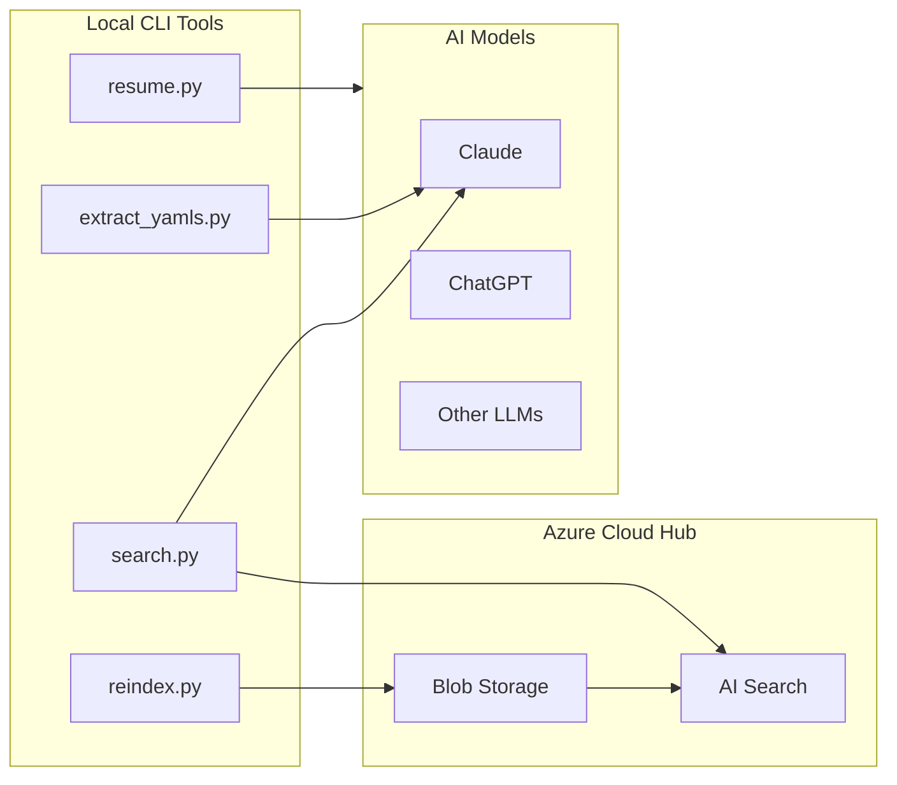

# Architecture & Design Decisions

## Overview

AI Context Vault follows a **hub-and-spoke architecture** with Azure Cloud as the central hub and local CLI scripts as spokes.



---

## Key Design Decisions

### 1. YAML over Database

**Decision:** Store artifacts as YAML files in Git, not in a database.

**Rationale:**
- Version control out of the box (Git history)
- Human-readable and editable
- No database infrastructure needed
- Works offline
- Easy to diff and review changes

### 2. Azure over AWS/GCP

**Decision:** Azure Blob Storage + Azure AI Search as cloud backend.

**Rationale:**
- Azure AI Search provides full-text + semantic search in one service
- Free tier sufficient for research projects (50MB, 3 indexes)
- Azure for Students provides free credits
- Strong Python SDK support
- Enterprise-ready for scaling

### 3. Token Optimization via Local Parsing

**Decision:** `resume.py` generates context locally without any API calls.

**Rationale:**
- $0 cost per resume operation
- No network dependency (works offline)
- Instant response (no API latency)
- Privacy: no data leaves the machine during resume
- 98% token reduction (30,000 → ~600 tokens)

### 4. Model-Agnostic Design

**Decision:** Output works with ANY AI model, not just Claude.

**Rationale:**
- No vendor lock-in
- Future-proof (new models will work automatically)
- Team flexibility (different members use different models)
- The `resume.py` output is plain text → universal

### 5. SHA1-Based Document IDs

**Decision:** Generate document IDs from `sha1(path + content)`.

**Rationale:**
- Deterministic: same file always gets same ID
- Idempotent: re-running `reindex.py` is safe (upsert)
- Content-aware: changed content gets new ID
- No UUID collisions or sequential ID gaps

### 6. Batch Upload with Retry/Backoff

**Decision:** Small batches (2 docs) with exponential backoff for 429 errors.

**Rationale:**
- Azure free tier has strict rate limits
- Small batches prevent partial failures
- Exponential backoff is cloud-native best practice
- Reliable even on slow connections

---

## Data Flow

```
User works in AI chat
         ↓
Chat transcript saved as .txt
         ↓
extract_yamls.py → Claude API → structured YAML artifacts
         ↓
YAML files committed to Git
         ↓
reindex.py → Azure Blob Storage + Azure AI Search
         ↓
search.py → Azure Search retrieval + Claude generation
         ↓
resume.py → token-optimized context → clipboard → new AI session
```

## Security

- **Credentials:** `.env` file, never committed to Git
- **API Keys:** Loaded via `python-dotenv` at runtime
- **Future:** Planned migration to Azure Managed Identity
- **Data:** All artifacts stored in user's own Azure subscription
- **Privacy:** `resume.py` works entirely locally (no data sent)

---

## Cost Analysis

| Component | Free Tier | Paid Tier |
|---|---|---|
| Azure Blob Storage | 5GB free | ~$0.02/GB/month |
| Azure AI Search | 50MB, 3 indexes | From $70/month |
| Claude API (search) | – | ~$0.01-0.05/query |
| Claude API (extract) | – | ~$0.05-0.20/extraction |
| resume.py | **Always $0** | **Always $0** |
| reindex.py | **Always $0** | **Always $0** |

**Typical monthly cost for a research project: $0-5**
