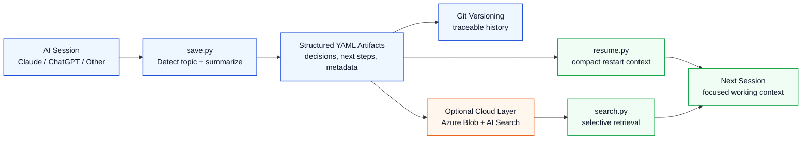

# Technical Overview Diagram

## Message

- raw chat becomes structured artifacts with metadata
- `save.py` and `resume.py` separate persistence from restart context
- Git preserves auditability and change history
- Azure Blob Storage and Azure AI Search are optional for backup, sync, and retrieval
- `search.py` returns only relevant context to the next session
